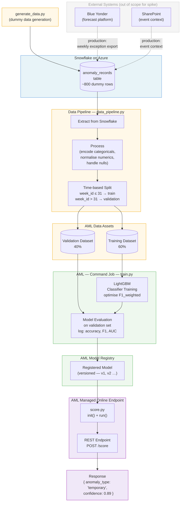

# Spike Plan — Snowflake → AML Pipeline → Deployed Model

## Context

This spike covers the **data and ML pipeline shape** of the Kmart demand forecast exception classification solution.
The goal is familiarity with the end-to-end workflow mechanics — not production quality.

A colleague is handling the agentic layer (UC1/UC4 agent logic and UI) in parallel.

**Use case being spiked:** Classifying a forecast anomaly as either a `temporary` anomaly (ringfence and ignore) or a `baseline_shift` (realign the mean). This maps to UC4 — Forecast Parameter Agent.

---

## Scope

| In scope | Out of scope |
|---|---|
| Snowflake provisioning (Azure) with dummy data | Blue Yonder integration (format unknown) |
| Data extraction and processing pipeline | Human approval UI |
| Time-based 60/40 train/validation split | Write-back to Blue Yonder |
| AML training job (LightGBM) | Agentic layer (colleague's workstream) |
| AML Model Registry | Real Kmart data |
| AML Managed Online Endpoint | AutoML (we write the training script ourselves) |

---

## Dummy Data Schema

Mimics what a real anomaly record would look like — combining Blue Yonder exception output with Snowflake historical context.

| Column | Type | Description |
|---|---|---|
| `week_id` | int | Week number (1–52). Used for time-based split. |
| `sku_id` | string | Product identifier |
| `store_id` | string | Store identifier |
| `dc_region` | string | Distribution centre region (e.g. `MEL`, `SYD`, `BNE`) |
| `product_lifecycle` | string | `G` (Growth), `M` (Maintain), or `D` (Decline) |
| `is_seasonal` | bool | Whether the product is seasonal |
| `forecast_bias` | float | Bias metric — positive = over-forecast, negative = under |
| `forecast_accuracy` | float | Accuracy score (0–1) |
| `volume_of_error` | float | Absolute volume error in units |
| `pct_error` | float | Percentage error |
| `weeks_affected` | int | Consecutive weeks showing the anomaly |
| `prior_anomaly_count` | int | Historical anomaly count for this SKU/store combination |
| `anomaly_type` | string | **Label** — `temporary` or `baseline_shift` |

~800 rows, roughly 70% `temporary` / 30% `baseline_shift` to reflect real-world class imbalance.

---

## Train / Validation Split — What 60/40 Means

The full dataset is divided into two non-overlapping chunks:

- **Training set (60%)** — the model learns from this data
- **Validation set (40%)** — the model is tested on data it has never seen, to check it has learned general patterns rather than memorising the training data

**We use a time-based split** (not random):
- Rows where `week_id ≤ 31` → training set
- Rows where `week_id > 31` → validation set

Time-based is important because anomalies are sequential — if you split randomly, future weeks leak into training, which inflates accuracy scores and hides how the model actually performs on unseen future data.

---

## Architecture Diagram



---

## Phases

### Phase 1 — Azure Setup

**Step 1 — Provision Snowflake**
- Find Snowflake in the Azure Marketplace and start a free trial
- Create: database → schema → table using the dummy schema above
- Note down: account URL, warehouse name, database name, schema name

**Step 2 — Provision Azure ML Workspace**
- Create an AML workspace via the Azure Portal
- AML automatically creates the supporting resources: Storage Account, Key Vault, Container Registry, Application Insights
- Note down: workspace name, resource group, subscription ID (needed for SDK config)

---

### Phase 2 — Dummy Data + Data Pipeline

**Step 3 — Generate and load dummy data**

A Python script (`generate_data.py`) that:
1. Generates ~800 synthetic anomaly rows matching the schema above
2. Uses random distributions that approximate real patterns (e.g. `weeks_affected` 1–2 → more likely `temporary`, `weeks_affected` 5+ → more likely `baseline_shift`)
3. Loads the rows into the Snowflake table using `snowflake-connector-python`

**Step 4 — Data extraction and processing pipeline**

A Python script (`data_pipeline.py`) that:
1. Connects to Snowflake and pulls all rows
2. Light processing:
   - Encode categoricals: `product_lifecycle` and `dc_region` → integer or one-hot
   - Normalise numerics: `forecast_bias`, `pct_error`, `volume_of_error`
   - Handle any nulls
3. Performs time-based split: `week_id ≤ 31` → training, `week_id > 31` → validation
4. Saves both splits as AML Data Assets (registered in the AML workspace via SDK v2)

---

### Phase 3 — ML Training Job

**Step 5 — AML training job (LightGBM)**

A training script (`train.py`) that:
1. Loads the training Data Asset from AML
2. Trains a LightGBM binary classifier targeting `anomaly_type`
3. Optimises for `F1_weighted` (not raw accuracy — class imbalance means raw accuracy is misleading)
4. Evaluates on the validation Data Asset
5. Logs these metrics to AML Experiments: `accuracy`, `f1_weighted`, `auc`
6. Saves the trained model as a `.pkl` or LightGBM native format

Submitted to AML as a **Command Job** via the AML Python SDK v2. AML runs it on a compute cluster and tracks all metrics.

**Target:** ≥ 80% F1_weighted (matches the 80% accuracy assumption from the requirements).

> **Why LightGBM, not AutoML?**
> AutoML is a feature inside AML that automatically tries many model types and picks the best. It requires no training code but gives less visibility.
> For this spike we write our own `train.py` — you understand exactly what's happening at each step. Swapping to AutoML later is straightforward.

---

### Phase 4 — Registry and Deployment

**Step 6 — Register model in AML Model Registry**

After a successful training run:
- Register the output model artifact in the AML Model Registry
- It gets a version number automatically (v1, v2, etc.)
- Visible in AML Studio under **Models**

**Step 7 — Deploy to Managed Online Endpoint**

Write a scoring script (`score.py`) with two functions:
- `init()` — loads the model when the endpoint starts up
- `run(data)` — takes a JSON payload, runs the model, returns prediction + confidence

Deploy to an AML **Managed Online Endpoint** — AML handles the containerisation and hosting.

Test the endpoint:
```json
POST /score
{
  "week_id": 45,
  "sku_id": "SKU-001",
  "store_id": "STORE-012",
  "dc_region": "MEL",
  "product_lifecycle": "M",
  "is_seasonal": false,
  "forecast_bias": 0.34,
  "forecast_accuracy": 0.61,
  "volume_of_error": 420,
  "pct_error": 0.48,
  "weeks_affected": 2,
  "prior_anomaly_count": 3
}
```

Expected response:
```json
{
  "anomaly_type": "temporary",
  "confidence": 0.89
}
```

---

## Spike Success Criteria

- [ ] Snowflake table populated with dummy data
- [ ] Data pipeline produces two registered AML Data Assets (training + validation)
- [ ] AML training job completes and metrics are visible in AML Experiments
- [ ] Trained model appears in AML Model Registry (versioned)
- [ ] Managed Online Endpoint returns a valid prediction + confidence score for a sample payload
- [ ] Full pipeline can be re-run end-to-end without code changes (just re-run the scripts)

---

## Technology Choices

| Component | Technology | Why |
|---|---|---|
| Data store | Snowflake on Azure | Matches the production data source; free trial available |
| Data pipeline | Python scripts | Simple for spike; can be wrapped in ADF later |
| Snowflake connection | `snowflake-connector-python` | Official Snowflake Python SDK |
| ML platform | Azure Machine Learning (AML) | Target production platform; SDK v2 |
| ML model | LightGBM | Industry standard for tabular classification; produces SHAP values for explainability |
| Deployment | AML Managed Online Endpoint | Serverless hosting inside AML; no infra to manage |

---

## Model Selection — Why LightGBM and Alternatives to Consider

### Why LightGBM (current choice)

LightGBM is a **gradient boosted decision tree** algorithm. Training builds 200 trees sequentially — each tree corrects the mistakes of the previous one, following the gradient (mathematical slope) of the error downhill until it can't improve further. The result is a set of fixed rules stored in `model.txt` that are applied at inference time.

Chosen for this use case because:
- **Best default for tabular data** — consistently outperforms other approaches on structured rows with <100k records
- **Handles class imbalance natively** — `class_weight="balanced"` adjusts for our 70/30 `temporary`/`baseline_shift` split
- **Explainability via SHAP** — can show *why* each prediction was made (e.g. "weeks_affected=6 contributed +0.4 toward baseline_shift"), which is critical for Kmart analysts to trust the model
- **Fast training and inference** — trains in seconds on 800 rows, predicts in <10ms per record
- **Robust to noisy features** — trees naturally ignore features that don't help, no manual feature selection needed

### Alternatives to evaluate with real data

| Model | How it works | Consider when |
|---|---|---|
| **XGBoost** | Same gradient boosting concept as LightGBM, slightly different implementation | Good head-to-head comparison; sometimes better on smaller datasets |
| **Random Forest** | Builds 200 trees *independently* (not sequentially) then votes | More robust to overfitting; good baseline if LightGBM overfits on real data |
| **Logistic Regression** | Finds a linear boundary between the two classes | Good interpretability benchmark — if it matches LightGBM accuracy, the problem is linearly separable and a simpler model suffices |
| **Neural Network (MLP)** | Layers of weighted connections learn complex non-linear patterns | Only worth trying with >10k rows; overkill for current data size but relevant if Blue Yonder provides richer historical data |
| **AutoML** | AML automatically tries many algorithms and hyperparameters, picks the best | Use as a benchmarking sweep when real data arrives — can replace the manual model selection process |

### Recommended approach with real data
1. Run LightGBM as the baseline (already built)
2. Run XGBoost and Random Forest alongside it
3. Compare F1_weighted scores on the held-out validation set
4. Use SHAP to verify the winning model's decisions make business sense before deploying

---

## Future Directions (Post-Spike)

### Real-time anomaly detection
The current spike uses a **weekly batch model** — Blue Yonder produces an exception report once a week, the pipeline processes it, corrections are made. This is the right starting point.

A future direction raised during planning is moving toward **real-time (or near real-time) monitoring**:
- Instead of waiting for the weekly batch, continuously monitor forecast data as it streams in
- Flag anomalies *as they emerge* mid-week rather than discovering 1,300 piled up on Friday
- Particularly valuable for event-driven scenarios (SCN-003) — when a port strike hits on Tuesday, the system detects and ringfences affected SKUs immediately rather than waiting until the weekly cycle

**Why it matters for evaluation:** The 3-week evaluation lag (minimum time to see downstream forecast effects) is compounded by the weekly batch cadence. Real-time detection compresses this — corrections made earlier produce measurable outcomes sooner, tightening the feedback loop on model accuracy.

**What it would require:** Streaming data from Blue Yonder (currently unknown — to be confirmed in Discovery), an event-driven pipeline trigger (Azure Event Grid or similar) rather than a scheduled batch, and the Managed Online Endpoint already built in this spike (the model itself doesn't change — just when and how often it's called).

This maps to the **"Model Evaluation (realtime)"** component visible in the original architecture diagram.

---

## File Structure (to be created)

```
work/
  spike/
    generate_data.py       ← generates dummy data and loads to Snowflake
    data_pipeline.py       ← extracts from Snowflake, processes, registers AML Data Assets
    train.py               ← LightGBM training script (runs as AML Job)
    score.py               ← scoring script for the deployed endpoint
    submit_training.py     ← submits train.py as an AML Command Job
    deploy_endpoint.py     ← registers model and deploys to Managed Online Endpoint
    requirements.txt       ← Python dependencies
    config.yml             ← AML workspace config (workspace name, RG, subscription)
```
